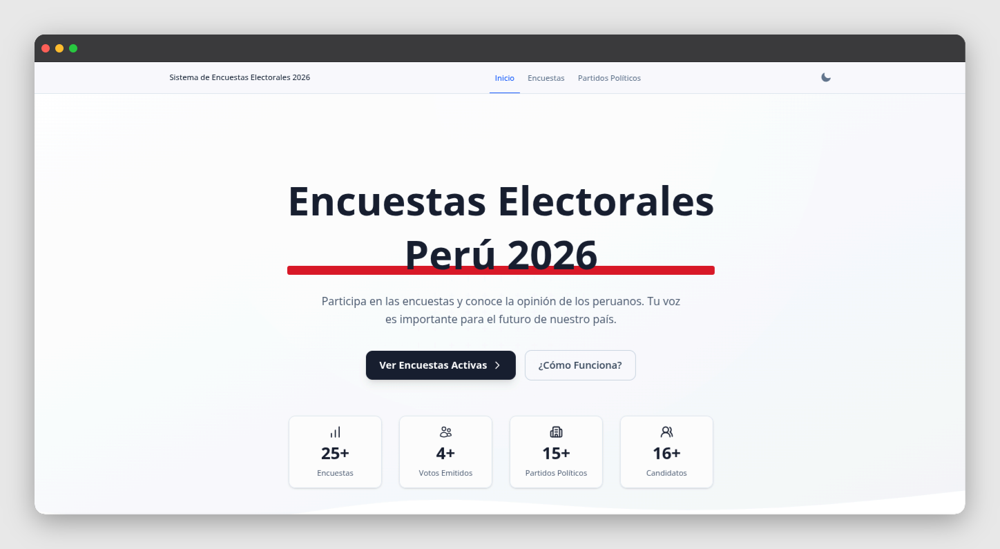

# 🗳️ Sistema de Encuestas Electorales

Sistema de encuestas electorales, diseñado para registrar, gestionar y visualizar intención de voto a nivel nacional, regional, provincial y distrital.




---

## 📋 Tabla de contenidos

- [Descripción](#-descripción)
- [Módulos](#-módulos)
- [Tecnologías](#-tecnologías)
- [Requisitos](#-requisitos)
- [Instalación](#-instalación)
- [Migraciones y Seeders](#-migraciones-y-seeders)

---

## 📌 Descripción

**Sistema de encuestas electorales** es un sistema web para la gestión de encuestas electorales. Permite crear encuestas con alcance nacional, regional, provincial o distrital, registrar candidatos vinculados a partidos políticos, y recolectar votos con mecanismos de detección de duplicados y comportamiento sospechoso.

---

## 🧩 Módulos

### 👤 Gestión de Usuarios
- CRUD de usuarios con control de acceso.
- Autenticación y control de acceso mediante Filament.

### 🗂️ Categorías
- Agrupación de encuestas por tipo: nacionales, regionales, distritales, municipales, etc.
- Slugs únicos por categoría.

### 🏛️ Partidos Políticos
- Registro de partidos con nombre, siglas, logotipo y color representativo.
- Vinculación de candidatos a sus respectivos partidos.

### 📊 Encuestas (Polls)
- Creación de encuestas con alcance: `nacional`, `regional`, `provincial` o `distrital`.
- Estados: `borrador`, `activo`, `cerrado`, `archivado`.
- Fechas de inicio y cierre configurables.
- Asignación a una categoría y a un ámbito geográfico específico.

### 🧑‍💼 Candidatos
- Registro de candidatos por encuesta.
- Vinculación con los partidos políticos.
- Foto, biografía y número de lista.

### 🗳️ Votos
- Registro de votos con tipos: `válido`, `no sabe`, `ninguno`.
- Prevención de duplicados mediante:
  - `fingerprint` del navegador
  - `composite_hash` único
  - `poll_token` por sesión
  - Registro de IP y user agent
- Marcado de votos sospechosos.

### ⚙️ Configuración del Sitio
- Módulo de ajustes globales del sistema.

---

## 🛠️ Tecnologías

| Tecnología | Versión |
|---|---|
| PHP | 8.2 o superior |
| Laravel | 12.x |
| Filament | 5.x |
| Livewire | 4.x |
| MySQL | 8.x |
| Composer | 2.x |
| Node.js | 18.x o superior |

---

## ✅ Requisitos

- PHP >= 8.2 con extensiones: `pdo`, `mbstring`, `openssl`, `tokenizer`, `xml`, `ctype`, `json`, `bcmath`
- Composer >= 2.x
- Node.js >= 18.x y NPM
- MySQL >= 8.x
- Git

---

## 🚀 Instalación

### 1. Descomprimir el archivo zip


### 2. Ir al directorio del proyecto
```bash
cd filament-vote
```

### 3. Instalar dependencias PHP
```bash
composer install
```

### 4. Instalar dependencias frontend
```bash
npm install && npm run build
```

### 5. Configurar el entorno
```bash
cp .env.example .env
php artisan key:generate
```

### 6. Configurar la base de datos en `.env`
```env
DB_CONNECTION=mysql
DB_HOST=127.0.0.1
DB_PORT=3306
DB_DATABASE=sistemapoll_peru
DB_USERNAME=tu_usuario
DB_PASSWORD=tu_contraseña
```

---

## 📦 Migraciones y Seeders

### Ejecutar migraciones
```bash
php artisan migrate
```

### Ejecutar seeders
```bash
php artisan db:seed
```

### Credenciales del administrador
```
Email:    admin@example.com
Password: 123456789
```

### Levantar el servidor local
```bash
php artisan serve
```

Web principal: `http://localhost:8000`

Panel administrador: `http://localhost:8000/admin`

---
